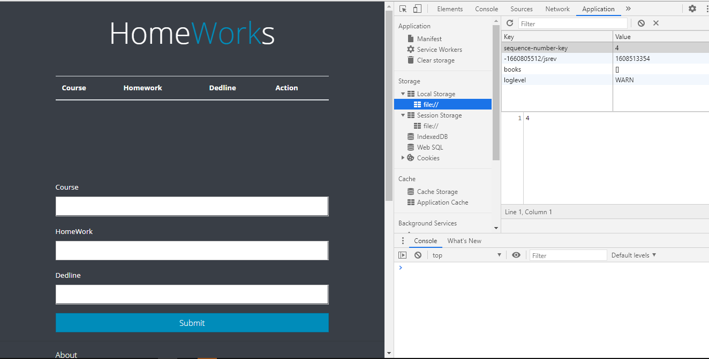

**Tutorial how create this app.**

The homeWork App is simple project developed using JavaScript(jQuery),CSS(Bootstrap) and HTML.

**index.html**

First of all you should create simple html page with basic structure inside.
and add reqired links like bootstrap(i'm using local bootstrap , i think it will load faster )

***body***

Inside the body tag there are only one div styled with bootstrap
and in the div there are main content:
h1 tag used as header with the text

table tag for displaying recorded homeworks

and form tag for adding hometask to the table

and all this tags are styled with bootstrap

**CSS**

in this app we used mainly bootstrap and didn't create external CSS . And there are a small part of internal CSS

**JS**

In Js mainly we will work with classes and jQuery

**Class Book**

we are creating Book class, with the constructor that takes 
3 parameters course homework dedilne 

**Class UI**

in the UI class there are 3 methods for 
1.DisplatBooks -> for displaying Home tasks
in the method we are creating array of instances of Book
and calling Store class method getBooks that loads array of books from local storage.
2.AddBookToList -> adding task to the list
in this method we are creating tr tag with jQuery to add new row to the list 
3.DeleteBook -> for deleting task from list on the click 

![7img] (tutorialpics/7img.png)

**Store class**

getBooks->this method is used to load data from localstorage
saveBook->take as parameter book and saves it to the localstorage
removeBook-> deletes task from localstorage and from the table

**jQuery**

Onload eventListener calls UI display method for loading data from localstorage and there are event listener of form's submit button.Onclick to submit button const variables gets values from form if they are not empty and calls UI's static method to display it on the table then calls Store savebook method to store data on localstorage.
Last eventListener is onclick to button delete that removes data from localstorage and from table

